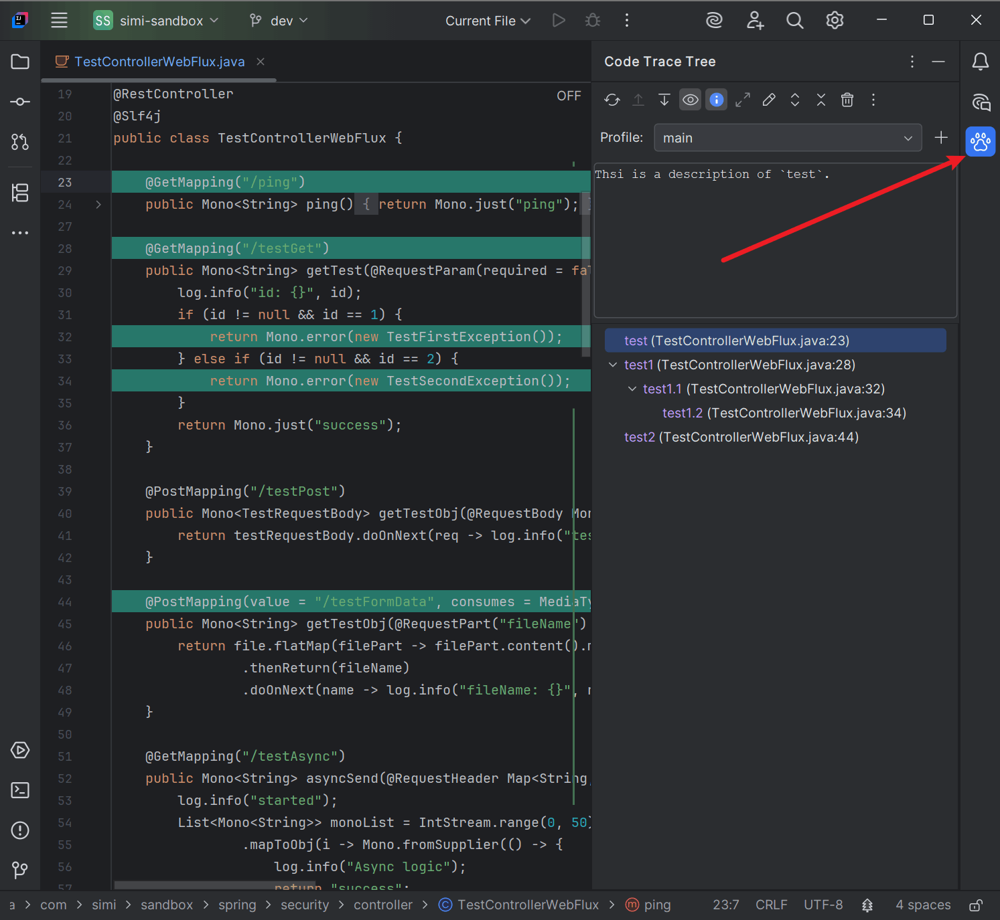

# Code Trace Tree

  

----

<!-- Plugin description -->

  Trace code in a tree structure.
  Build and display code workflows as nested trace points
  (lines, files, and directories) so you can follow the flow and jump back to source anytime.
  <b>Double-click</b> any trace point to navigate to its source, with support for multiple trace levels.

  Pair it with the Agent Skill so a coding agent can search, add, move, and rebind traces, and
  notify the IDE when you ask (for example Claude Code, Cursor, or Gemini CLI). 
  This plugin does <b>not</b> include an AI agent; install your preferred agent separately, then
  install the Code Trace Tree skill. Once installed, the agent can
  <b>auto-load</b> it when relevant.

<!-- Plugin description end -->

# Preview

<!-- Plugin description -->
<h1>How to use</h1>
<ol>
  <li>Open the <b>Code Trace Tree</b> tool window (right side of the IDE).</li>
  <li>Use the <b>Profile</b> selector under the toolbar to switch trees, add a profile (+), or delete one from the dropdown.</li>
  <li>In the editor, right-click a line in a <b>project file</b> and choose:
    <ul>
      <li><b>Create a Root Trace Point</b> — start a new line-level trace tree (selects the new node; does not jump)</li>
      <li><b>Create a Trace Point (Under Selected)</b> — add a child under the selected node(s) in the tree (new node is selected)</li>
      <li><b>Update the selected code trace point</b> — move the selected tree node(s) to the current line</li>
      <li><b>Go to the Trace Point in the tree panel (Only matching)</b> — selects and reveals matching node(s) for the current line; does nothing when none match</li>
    </ul>
  </li>
  <li>In the <b>Project</b> tool window, right-click a file or directory <b>inside the project</b> and choose:
    <ul>
      <li><b>Create a Root Trace Point</b> — add a file or directory node at the root</li>
      <li><b>Create a Trace Point (Under Selected)</b> — add that file/directory under the selected tree node(s)</li>
    </ul>
  </li>
  <li>Single-click a node to select it; double-click to jump to that location (line, file, or Project View for directories).</li>
  <li>Right-click a node and choose <b>Copy Label</b> (or use Ctrl/Cmd+C) to copy its display text, e.g. <code>test233 (TestControllerWebFlux.java:54)</code>.</li>
  <li>Right-click a line trace point and choose <b>Show Line Content</b> to view its saved trimmed line text.</li>
  <li>Use the tool window toolbar to expand/collapse, <b>Recheck Trace Availability</b>, <b>Remove Invalid Trace Points</b>, reorder, highlight, prompt for name on create, or edit descriptions. Import/Export live under <b>Advanced Settings</b>.</li>
</ol>

  <b>TIPS:</b> Prefer creating line trace points on text that is <b>unique in that file</b> (or uncommon),
  not generic lines like <code>}</code> or <code>return;</code>. Empty lines are not allowed.
  The plugin stores occurrence counts to re-find the line after it moves; unique content rebinds more reliably.
  Opening a file re-checks line traces in that file so highlights and validity stay aligned.
  Use <b>Recheck Trace Availability</b> in the toolbar to recheck every line, file, and directory trace.

<h1>Agent Skill</h1>

  This plugin does <b>not</b> ship an AI agent. Install your preferred coding agent, then install
  the Code Trace Tree skill. Once installed, the agent can <b>auto-load</b> it when your
  request is relevant. The skill is general — any agent that can load skill folders can use it.

Example agents:

<ul>
  <li><a href="https://claude.com/claude-code">Claude Code</a></li>
  <li><a href="https://cursor.com">Cursor</a></li>
  <li><a href="https://docs.github.com/en/copilot">GitHub Copilot</a> (agent skills)</li>
  <li><a href="https://developers.openai.com/codex">Codex</a></li>
  <li><a href="https://geminicli.com">Gemini CLI</a></li>
</ul>

The skill lets the agent:

<ul>
  <li>Resolve the bound global storage XML for the project</li>
  <li>Search, add, move, and delete trace points</li>
  <li>Rebind line locations after source edits on disk</li>
  <li>Ask the IDE to reload / refresh plugin data</li>
  <li>Select or navigate to nodes in the Code Trace Tree tool window</li>
</ul>

  <b>Python required:</b> the main skill ops (<code>trace_tree</code> search / add / move / delete / rebind)
  run <code>trace_tree.py</code>, so <b>Python 3</b> must be on your <code>PATH</code>
  (<code>python3</code> or <code>python</code>).
  Resolve / refresh / select helper scripts are plain shell or batch and do not need Python.

<h2>Install the skill (recommended)</h2>
<ol>
  <li>Download <code>code-trace-tree-skill-1.3.1.zip</code> from the <a href="https://github.com/saidake/code-trace-tree-jetbrains/releases/tag/v1.3.1">GitHub Release</a> (one zip works across agents).</li>
  <li>Extract it <b>into</b> the skills directory for your agent (table below). When asked, replace the existing <code>code-trace-tree</code> folder. The zip contains one <code>code-trace-tree</code> folder (with <code>SKILL.md</code> inside). Global = all projects; project-local = this repo only.</li>
</ol>

  Done when the skills directory contains <code>code-trace-tree/SKILL.md</code>
  (not the zip file, and not an extra nested <code>code-trace-tree/code-trace-tree</code> folder).

<table>
  <thead>
    <tr><th>Agent (examples)</th><th>Global</th><th>Project-local</th></tr>
  </thead>
  <tbody>
    <tr><td>Claude Code</td><td><code>~/.claude/skills/</code></td><td><code>.claude/skills/</code></td></tr>
    <tr><td>Cursor</td><td><code>~/.cursor/skills/</code></td><td><code>.cursor/skills/</code></td></tr>
    <tr><td>GitHub Copilot</td><td><code>~/.copilot/skills/</code></td><td><code>.github/skills/</code></td></tr>
    <tr><td>Codex</td><td><code>~/.agents/skills/</code></td><td><code>.agents/skills/</code></td></tr>
    <tr><td>Gemini CLI</td><td><code>~/.gemini/skills/</code></td><td><code>.gemini/skills/</code></td></tr>
  </tbody>
</table>

<h2>Install example (command line, optional)</h2>

Same result as the steps above. Claude Code global path, Linux &amp; macOS:

<pre><code>curl -L https://github.com/saidake/code-trace-tree-jetbrains/releases/download/v1.3.1/code-trace-tree-skill-1.3.1.zip -o code-trace-tree-skill-1.3.1.zip</code>
<code>rm -rf ~/.claude/skills/code-trace-tree</code>
<code>mkdir -p ~/.claude/skills</code>
<code>unzip code-trace-tree-skill-1.3.1.zip -d ~/.claude/skills/</code>
<code>rm code-trace-tree-skill-1.3.1.zip</code>
</pre>

Project-local: unzip into <code>.claude/skills/</code> instead of <code>~/.claude/skills/</code>. For other agents, use the same zip and the skills path from the table above.

<h2>Install example (Windows PowerShell, optional)</h2>

Claude Code global path:

<pre><code>Invoke-WebRequest -Uri "https://github.com/saidake/code-trace-tree-jetbrains/releases/download/v1.3.1/code-trace-tree-skill-1.3.1.zip" -OutFile "code-trace-tree-skill-1.3.1.zip"</code>
<code>Remove-Item -Recurse -Force "$HOME\.claude\skills\code-trace-tree" -ErrorAction SilentlyContinue</code>
<code>New-Item -ItemType Directory -Force -Path "$HOME\.claude\skills" | Out-Null</code>
<code>Expand-Archive -Path "code-trace-tree-skill-1.3.1.zip" -DestinationPath "$HOME\.claude\skills" -Force</code>
<code>Remove-Item "code-trace-tree-skill-1.3.1.zip"</code>
</pre>

Project-local: extract into <code>.claude\skills\</code>. For other agents, use the same zip and change the destination to that agent’s skills path (see the table above for examples).

<h2>How to use the skill</h2>

  Installing the skill makes it available to the agent:

<ul>
  <li><b>Project-local</b> — available in agent sessions for that project</li>
  <li><b>Global</b> — available across projects for that agent</li>
</ul>

  If the IDE is open on this project, it loads the agent’s
  trace point changes in real time (no manual reload).

Examples:

<pre><code>Help me generate some simple trace points related to the current topic.
</code></pre>
<pre><code>Add simple trace points along the call path of method `test`.
</code></pre>

<h1>Storage</h1>

Trace data is stored in a shared global folder:

<ul>
  <li>Windows: <code>%LOCALAPPDATA%\code-trace-tree</code></li>
  <li>macOS: <code>~/Library/Application Support/code-trace-tree</code></li>
  <li>Linux: <code>$XDG_CONFIG_HOME/code-trace-tree</code> or <code>~/.config/code-trace-tree</code></li>
</ul>

  Each project uses <code>&lt;projectId&gt;.xml</code> in that folder
  (legacy <code>&lt;FolderName&gt;.xml</code> files from older releases are still resolved and
  renamed when found). The IDE may cache the id in
  <code>.idea/code-trace-tree.project.id</code>. Agents use path mode: prefer an existing
  <code>.idea</code> id (recreate that XML if missing), else path match, else Case C create
  with <code>&lt;path&gt;</code> only (never write the <code>.idea</code> id). The IDE binds
  via path match + <code>storage-ready</code> (signal body = project path).
  Highlight colors are a global preference (<code>settings.xml</code> in that folder),
  shared across projects and IDEs (defaults <code>#FFFFC8</code> light, <code>#236C60</code> dark).

<!-- Plugin description end -->

# Development

- JDK 21
- Open the project root in IntelliJ IDEA and import as a Gradle project
- Run the **Run Plugin** configuration (or `:main:runIde`) to launch a sandbox IDE
- Shared agent skill source: `skills/code-trace-tree/`

# Contributing

If you would like to contribute to the code base or fix an issue, please see [CONTRIBUTING.md](CONTRIBUTING.md).
