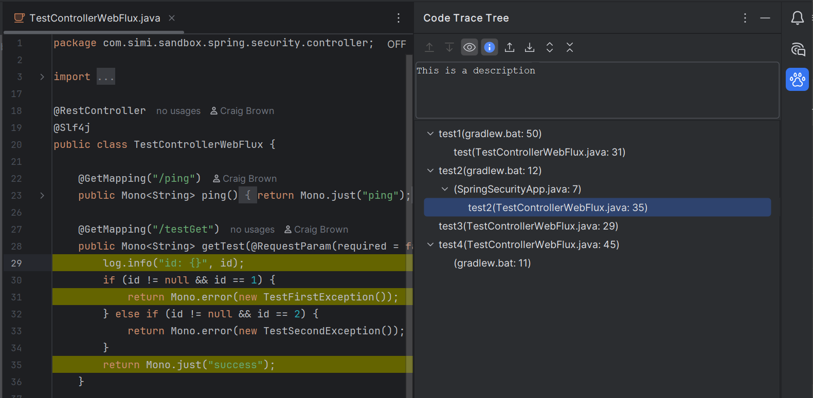

# Code Trace Tree


[](https://plugins.jetbrains.com/plugin/MARKETPLACE_ID)
[](https://plugins.jetbrains.com/plugin/MARKETPLACE_ID)


----

<!-- Plugin description -->
<p>
  Code Trace Tree is a JetBrains plugin that lets you trace code in a tree structure.
  Double click any trace point to navigate to its source, with support for multiple trace levels.
</p>
<!-- Plugin description end -->

# Preview


<!-- Plugin description -->
<h3>How to use</h3>
<ol>
  <li>Open the <b>Code Trace Tree</b> tool window (right side of the IDE).</li>
  <li>Use the <b>Profile</b> selector under the toolbar to switch trees, add a profile (+), or delete one from the dropdown.</li>
  <li>In the editor, right-click a line and choose:
    <ul>
      <li><b>Create a Root Trace Point</b> — start a new line-level trace tree</li>
      <li><b>Create a Trace Point (Under Selected)</b> — add a child under the selected node(s) in the tree</li>
      <li><b>Update the selected code trace point</b> — move the selected tree node(s) to the current line</li>
      <li><b>Go to the Trace Point in the tree panel</b> — shown only when the current single line is a highlighted trace point; selects and reveals that node in the tree</li>
    </ul>
  </li>
  <li>In the <b>Project</b> tool window, right-click a file or directory and choose:
    <ul>
      <li><b>Create a Root Trace Point</b> — add a file or directory node at the root</li>
      <li><b>Create a Trace Point (Under Selected)</b> — add that file/directory under the selected tree node(s)</li>
    </ul>
  </li>
  <li>Double-click a node in the tree to jump to that location (line, file, or Project View for directories).</li>
  <li>Use the tool window toolbar to expand/collapse, reorder, highlight, import/export, or edit descriptions.</li>
</ol>

<h3>Storage</h3>
<p>Trace data is stored in a shared global folder:</p>
<ul>
  <li>Windows: <code>%LOCALAPPDATA%\code-trace-tree</code></li>
  <li>macOS: <code>~/Library/Application Support/code-trace-tree</code></li>
  <li>Linux: <code>$XDG_CONFIG_HOME/code-trace-tree</code> or <code>~/.config/code-trace-tree</code></li>
</ul>
<p>
  Each project keeps only a small id file under <code>.idea/code-trace-tree.project.id</code>
  (falls back to <code>.vscode/code-trace-tree.project.id</code> when present).
  Old unused XML files are not deleted automatically — remove them from that folder if you no longer need them.
</p>
<p>
  External agents can edit the global XML and ask the IDE to reload by writing
  <code>.idea/code-trace-tree.refresh-request</code> (or by saving the XML while the project is open).
  See <code>.claude/skills/code-trace-tree/</code> for the Claude Code skill and helper scripts.
</p>
<!-- Plugin description end -->

# Development

- JDK 21
- Open the project root in IntelliJ IDEA and import as a Gradle project
- Run the **Run Plugin** configuration (or `:main:runIde`) to launch a sandbox IDE

# Claude skill (agent access)

Download `code-trace-tree-skill-<version>.zip` from the [GitHub Releases](https://github.com/saidake/code-trace-tree-jetbrains/releases) page, then install:

```bash
# Personal (all projects)
unzip code-trace-tree-skill-1.1.0.zip -d ~/.claude/skills/

# Or project-local
mkdir -p .claude/skills
unzip code-trace-tree-skill-1.1.0.zip -d .claude/skills/
```

Then in a project that uses Code Trace Tree:

```bash
python ~/.claude/skills/code-trace-tree/scripts/resolve_storage.py
python ~/.claude/skills/code-trace-tree/scripts/request_refresh.py
```

# Contributing

If you would like to contribute to the code base or fix an issue, please see [CONTRIBUTING.md](CONTRIBUTING.md).
